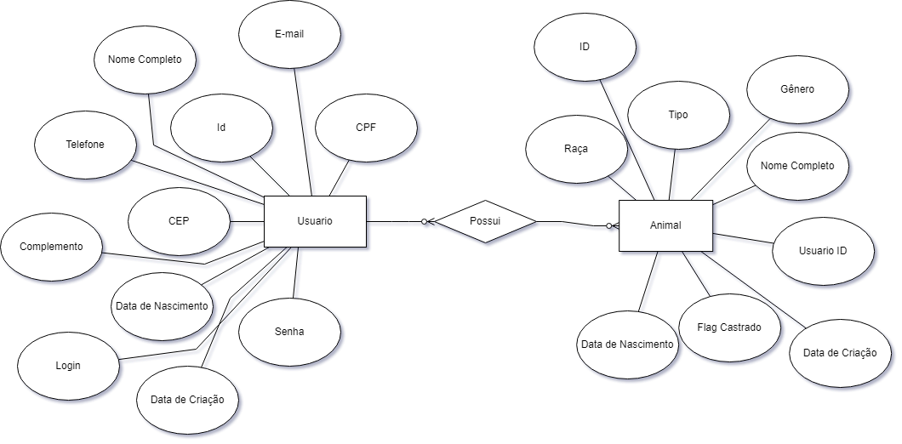

# Arquitetura da Solução

Pré-requisitos: <a href="3-Projeto de Interface.md"> Projeto de Interface</a>

Definição de como o software é estruturado em termos dos componentes que fazem parte da solução e do ambiente de hospedagem da aplicação.

## Diagrama de Classes

O diagrama de classes ilustra graficamente como será a estrutura do software, e como cada uma das classes da sua estrutura estarão interligadas. Essas classes servem de modelo para materializar os objetos que executarão na memória.

Diagrama de Classes.

> - 

## Modelo ER 

O Modelo ER representa através de um diagrama como as entidades (coisas, objetos) se relacionam entre si na aplicação interativa.

Ferramenta para geração deste artefato: Draw.io.

> -   

## Esquema Relacional

O Esquema Relacional corresponde à representação dos dados em tabelas juntamente com as restrições de integridade e chave primária.
 
A Imagem abaixo foi retirada diretamente do banco implementado.

Ferramenta para geração deste artefato: lucid.

> -   

## Modelo Físico

> - [Projeto de Banco de Dados - ADOTE ANIMAIS](../src/db/banco.sql)
> - [Insert no banco - ADOTE ANIMAIS](../src/db/insert.sql)
> - [Listagem das classes - ADOTE ANIMAIS](../src/db/select.sql)

## Tecnologias Utilizadas

Diagrama de Classes : dbdiagram.io  
Modelo ER : lucid  
Projeto de Banco de Dados : DBeaver  
Esquema Relacional : DBeaver  
Modelo Fisico : DBeaver  

## Hospedagem

Website e app mobile : Netlify e geração de apk  
Banco de Dados e Back-End : Heroku 

## Qualidade de Software

A norma ISO/25010 define um modelo de qualidade de software que inclui oito características principais, cada uma com subcaracterísticas. A tabela abaixo apresenta essas características e subcaracterísticas:

|Característica de Qualidade	|Subcaracterísticas	|Métricas	|Pontos|
|--------------------|------------------------------------|----------------------------------------|----------------------------------------|
|Funcionalidade	|Adequação	|Número de requisitos atendidos	|5|
| |Acurácia	|Número de erros de precisão	|5|
| |Interoperabilidade	|Número de sistemas com os quais se comunica	|3|
| |Conformidade	|Número de requisitos regulamentares atendidos	|2|
| |Segurança de acesso	|Número de vulnerabilidades de segurança identificadas	|5|
|Confiabilidade	|Maturidade	|Tempo médio entre falhas	|4|
| |Tolerância a falhas	|Número máximo de falhas toleráveis antes da interrupção do serviço	|4|
| |Recuperabilidade	|Tempo médio de recuperação após uma falha	|3|
|Usabilidade	|Compreensibilidade	|Nível de escolaridade necessário para usar o sistema	|3|
| |Aprendizagem	|Tempo médio necessário para realizar uma tarefa pela primeira vez	|3|
| |Operabilidade	|Número de cliques/telas necessárias para realizar uma tarefa	|3|
| |Atratividade	|Número de usuários que avaliam o sistema como "atraente"	|2|
|Eficiência	|Comportamento em relação ao tempo	|Tempo médio de resposta do sistema	|4|
| |Comportamento em relação aos recursos	|Uso médio de recursos do sistema	|3|
|Manutenibilidade	|Analisabilidade	|Tempo médio necessário para identificar a causa de um defeito	|3|
| |Modificabilidade	|Tempo médio necessário para implementar uma alteração	|4|
| |Estabilidade	|Número de defeitos identificados após uma alteração	|3|
| |Testabilidade	|Número de testes necessários para validar uma alteração	|3|
|Portabilidade	|Adaptabilidade	|Número de plataformas para as quais o sistema é portável	|3|
| |Capacidade de instalação	|Tempo médio necessário para instalar o sistema	|2|
| |Coexistência	|Número de sistemas com os quais o sistema pode coexistir	|2|
| |Substituibilidade	|Tempo médio necessário para substituir o sistema	|2|