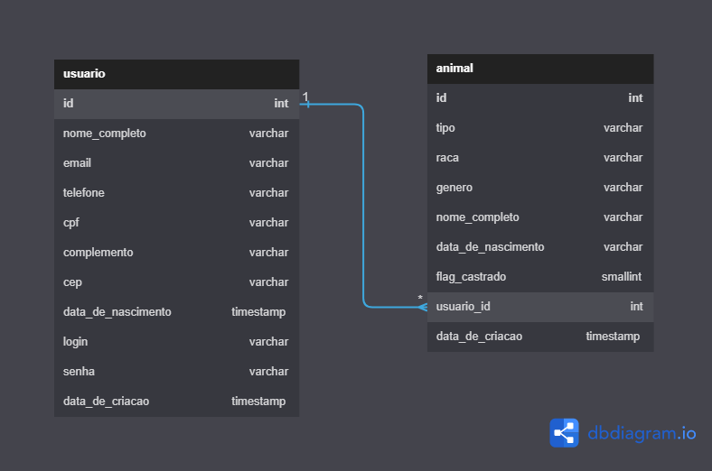

# Arquitetura da Solução

Pré-requisitos: <a href="3-Projeto de Interface.md"> Projeto de Interface</a>

Definição de como o software é estruturado em termos dos componentes que fazem parte da solução e do ambiente de hospedagem da aplicação.

## Diagrama de Classes

O diagrama de classes ilustra graficamente como será a estrutura do software, e como cada uma das classes da sua estrutura estarão interligadas. Essas classes servem de modelo para materializar os objetos que executarão na memória.

Diagrama de Classes.

> - 

## Modelo ER 

O Modelo ER representa através de um diagrama como as entidades (coisas, objetos) se relacionam entre si na aplicação interativa.

Ferramenta para geração deste artefato: Draw.io.

> -   

## Esquema Relacional

O Esquema Relacional corresponde à representação dos dados em tabelas juntamente com as restrições de integridade e chave primária.
 
A Imagem abaixo foi retirada diretamente do banco implementado.

Ferramenta para geração deste artefato: lucid.

> - 

## Modelo Físico

> - [Projeto de Banco de Dados - ADOTE ANIMAIS](../src/db/banco.sql)
> - [Insert no banco - ADOTE ANIMAIS](../src/db/insert.sql)
> - [Listagem das classes - ADOTE ANIMAIS](../src/db/select.sql)

## Tecnologias Utilizadas

Diagrama de Classes : dbdiagram.io  
Modelo ER : lucid  
Projeto de Banco de Dados : DBeaver  
Esquema Relacional : DBeaver  
Modelo Fisico : DBeaver  

## Hospedagem

Website e app mobile : Netlify e geração de apk  
Banco de Dados e Back-End : Heroku 

## Qualidade de Software

