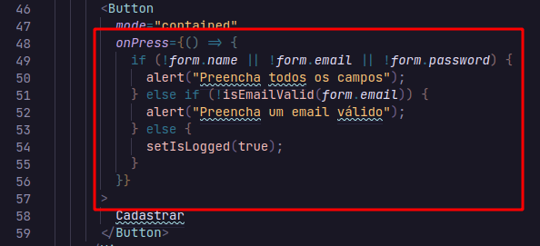
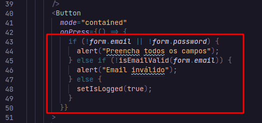
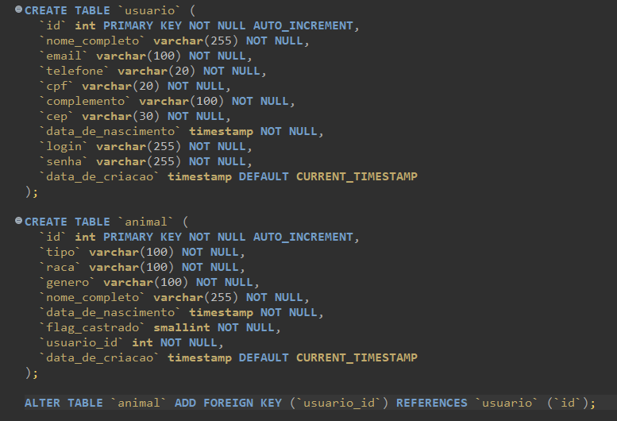
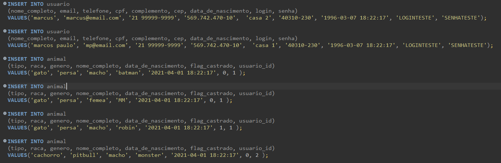
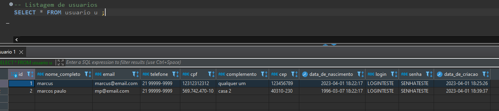
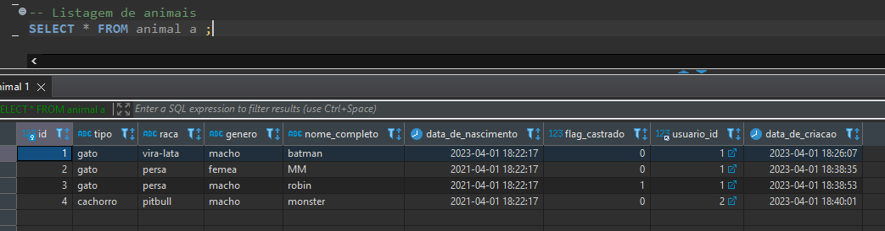
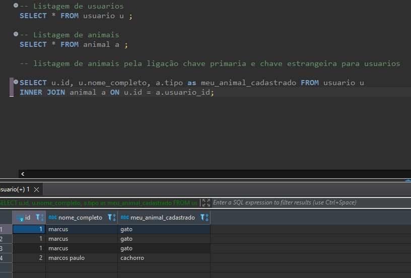
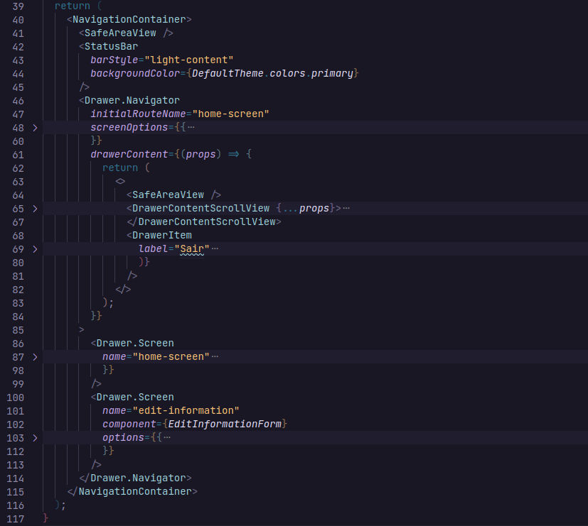

# Programação de Funcionalidades

## Contribuições dos membros

[Fornecimento do "retrato" atual do status das contribuições dos membros do time no Github podem ser encontrados em maioria na aba de PRs](https://github.com/ICEI-PUC-Minas-PMV-ADS/pmv-ads-2023-1-e3-proj-mov-t6-adote-animais/pulls?q=is%3Apr+is%3Aclosed)

[Comentários adicionais sobre as responsabilidades/atribuições de cada membro do time podem ser encontrados em maioria na Trello](https://trello.com/invite/b/945EfIBV/ATTI5d1f39ad137a0f9125cc2f6497d4219291C6A57C/adote-um-amigo)

### Quadro atual das contribuições dos membros do time:

- Amanda Cacholi: Elaboração da Metodologia (tecnologias, ferramentas, controle de versão e gerenciamento do projeto), Projeto de interface (diagrama de fluxo e wireframes interativos), Programação de funcionalidades (implementação de layouts em telas), Criação do quadro kanban no Trello e gestão de cards com as tarefas. Criação da navegação do app, validação de formulários de login e cadastro.

- Marcus Vincicius: Responsável por toda a parte de arquitetura e qualidade do projeto, sendo, Qualidade do Software(Tabela com métricas e pontuação), Padronização de Qualidade do Produto, Modelo ER(com base no banco), Tecnologias Utilizadas(para a arquitetura), Modelo Físico(com todas as implementações feitas e já funcionais no banco de dados), Esquema Relacional(com as relações entre as tabelas), Diagrama de Classes, Indicadores de Desempenho e Implementação do Banco de Dados.

[Link para acessar o trello](https://trello.com/invite/b/945EfIBV/ATTI5d1f39ad137a0f9125cc2f6497d4219291C6A57C/adote-um-amigo)

- **RF - 01** : Tela de cadastro onde usuários poderão se cadastrar. (Por Amanda Cacholi)
  

  - Validação:
    

- **RF - 02** : Tela de login de usuários. (Por Amanda Cacholi)
  

  - Validação:
    

- **RF - 03** : A página inicial do usuário vai mostrar os cards com os pets cadastrados para adoção. (Por Amanda Cacholi)
  

- **RF - 04** : Dentro dos cards vai ter as listas com as informações com os animais para adoção (Por Amanda Cacholi)
  

- **RF - 05** : Os cadastros podem fazer edições em seus perfis. (Por Amanda Cacholi)
- **RF - 06** : Os cadastros podem excluir seus perfis seus perfis. (Por Amanda Cacholi)

- **RF - 07**: Criação do Banco. (Por Marcus Vinicius)
  

- **RF - 08**: Populando o Banco. (Por Marcus Vinicius)
  

- **RF - 09**: Listagem de Usuarios. (Por Marcus Vinicius)
  

- **RF - 10**: Listagem de Animais. (Por Marcus Vinicius)
  

- **RF - 11**: Listagem de Usúario com seu animal cadastrado. (Por Marcus Vinicius)
  

- Navegação do app (Por Amanda Cacholi)
  
