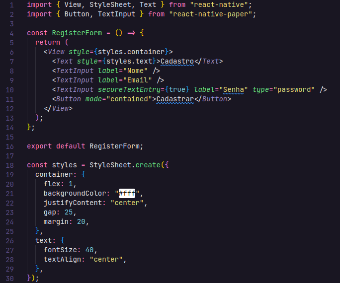
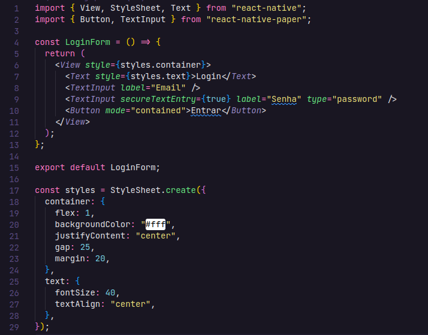
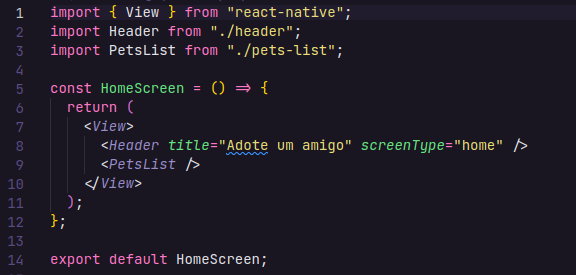
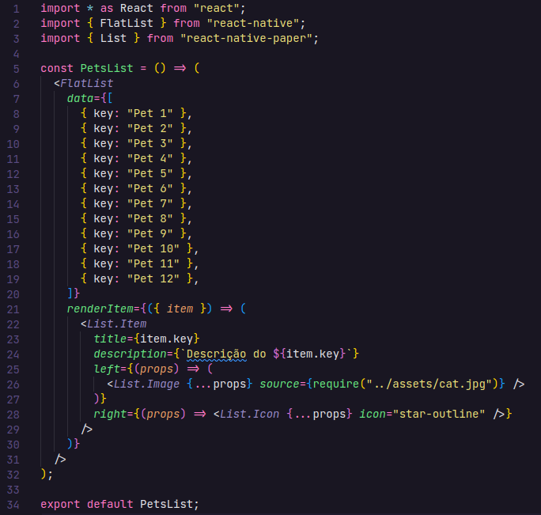
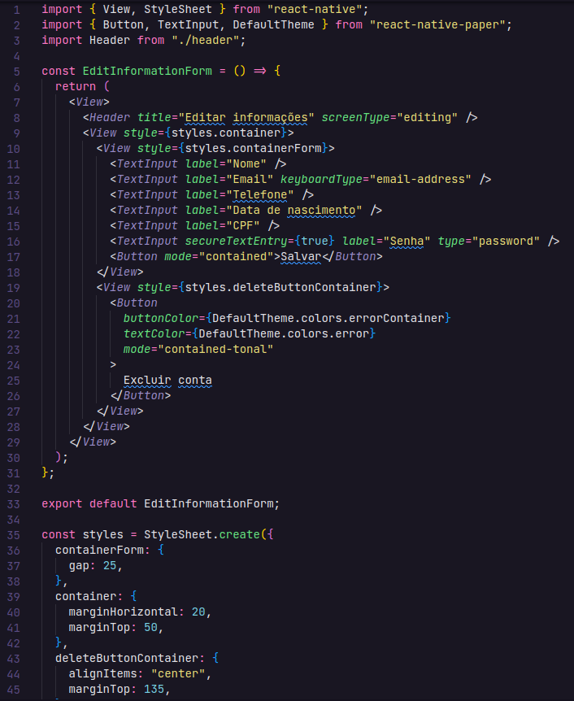

# Programação de Funcionalidades

- **RF - 01** : Tela de cadastro onde usuários poderão se cadastrar.
  

- **RF - 02** : Tela de login de usuários.
  

- **RF - 03** : A página inicial do usuário vai mostrar os cards com os pets cadastrados para adoção.
  

- **RF - 04** : Dentro dos cards vai ter as listas com as informações com os animais para adoção
  

- **RF - 05** : Os cadastros podem fazer edições em seus perfis.
- **RF - 06** : Os cadastros podem excluir seus perfis seus perfis.
  
