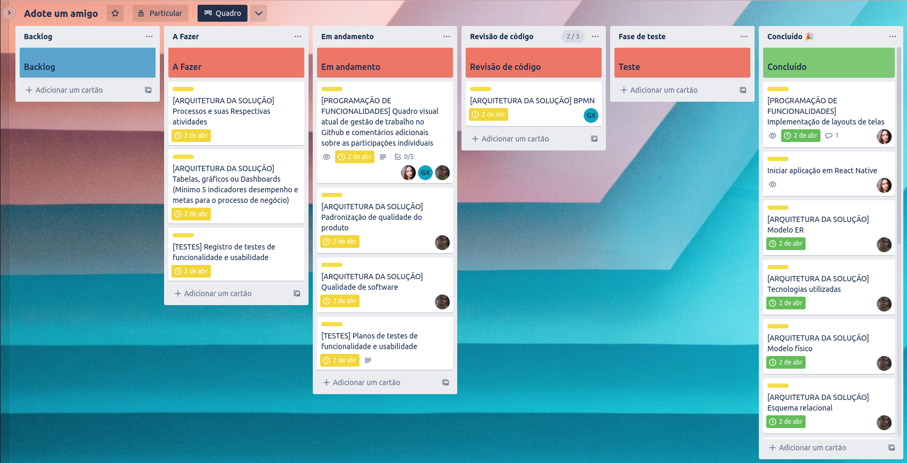

# Programação de Funcionalidades

### Quadro atual das contribuições dos membros do time:

- Amanda Cacholi: Elaboração da Metodologia (tecnologias, ferramentas, controle de versão e gerenciamento do projeto), Projeto de interface (diagrama de fluxo e wireframes interativos), Programação de funcionalidades (implementação de layouts em telas), Criação do quadro kanban no Trello e gestão de cards com as tarefas.

[Link para acessar o trello](https://trello.com/invite/b/945EfIBV/ATTI5d1f39ad137a0f9125cc2f6497d4219291C6A57C/adote-um-amigo)

## Contribuições dos membros

- [Fornecimento do "retrato" atual do status das contribuições dos membros do time no Github podem ser encontrados em maioria na aba de PRs](https://github.com/ICEI-PUC-Minas-PMV-ADS/pmv-ads-2023-1-e3-proj-mov-t6-adote-animais/pulls?q=is%3Apr+is%3Aclosed)

- [Comentários adicionais sobre as responsabilidades/atribuições de cada membro do time podem ser encontrados em maioria na Trello](https://trello.com/invite/b/945EfIBV/ATTI5d1f39ad137a0f9125cc2f6497d4219291C6A57C/adote-um-amigo)

> **Links Úteis**:
>
> - [Trabalhando com HTML5 Local Storage e JSON](https://www.devmedia.com.br/trabalhando-com-html5-local-storage-e-json/29045)
> - [JSON Tutorial](https://www.w3resource.com/JSON)
> - [JSON Data Set Sample](https://opensource.adobe.com/Spry/samples/data_region/JSONDataSetSample.html)
> - [JSON - Introduction (W3Schools)](https://www.w3schools.com/js/js_json_intro.asp)
> - [JSON Tutorial (TutorialsPoint)](https://www.tutorialspoint.com/json/index.htm)

- **RF - 01** : Tela de cadastro onde usuários poderão se cadastrar. (Por Amanda Cacholi)
  

- **RF - 02** : Tela de login de usuários. (Por Amanda Cacholi)
  

- **RF - 03** : A página inicial do usuário vai mostrar os cards com os pets cadastrados para adoção. (Por Amanda Cacholi)
  

- **RF - 04** : Dentro dos cards vai ter as listas com as informações com os animais para adoção (Por Amanda Cacholi)
  

- **RF - 05** : Os cadastros podem fazer edições em seus perfis. (Por Amanda Cacholi)
- **RF - 06** : Os cadastros podem excluir seus perfis seus perfis. (Por Amanda Cacholi)
  